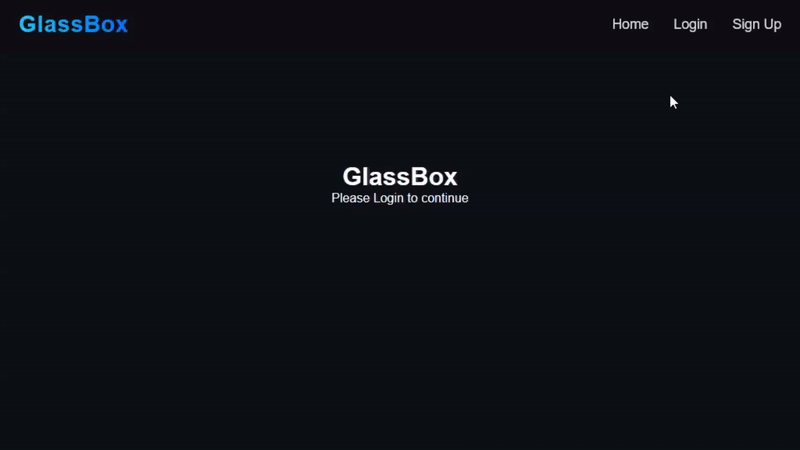

<div align="center">

# 🔮 GlassBox

### **See Through The Algorithm.**

*No Tracking. No Servers. Just Math.*

<br/>

[](https://www.rust-lang.org/)
[](https://leptos.dev/)
[](https://surrealdb.com/)
[](https://webassembly.org/)
[](https://www.docker.com/)

<br/>

*Every recommendation you see on Netflix, YouTube, or Spotify is decided by a black-box algorithm running on their servers, trained on your data, sold to advertisers.*

**GlassBox is the antithesis.** A fully transparent, privacy-first recommendation engine that runs **entirely in your browser**. The algorithm is open. The data is yours. The math is all you need.

---

</div>

## ✨ Key Features

| Feature | Description |
|---|---|
| 🔒 **Zero-Knowledge Architecture** | Your watch history, preferences, and interactions **never leave your device**. Data is stored in an embedded SurrealDB instance running inside your browser via IndexedDB. No servers. No telemetry. No exceptions. |
| 🧠 **Client-Side SVD Engine** | Recommendations are powered by a **Singular Value Decomposition (SVD)** algorithm compiled to WebAssembly. The linear algebra runs at near-native speed, directly in the browser — no API calls to a recommendation server. |
| 🔍 **Universal Search** | Search the entire TVMaze catalog of movies and shows. Results are fetched from the open TVMaze API (no authentication required), and every interaction feeds back into *your* local recommendation model. |
| ⚡ **Rust + WASM Performance** | Built with Leptos and compiled to WebAssembly. The entire application — UI, routing, database, and AI — ships as a single static bundle. No JavaScript frameworks. No runtime overhead. |

---

## 🎬 Demo

### 🔑 Login & Signup
> Create an account and sign in — all credentials are hashed and stored locally in the browser. No server ever sees your password.

<div align="center">

</div>

<br/>

### 🧠 Search & SVD Recommendations
> Search for movies, save them to your library, and watch the SVD engine build your personalized feed in real-time — entirely client-side.

<div align="center">

</div>

---

## 🏗️ Architecture

GlassBox replaces opaque server-side recommendation pipelines with a transparent, client-side algorithm:

```
┌─────────────────────────────────────────────────────────────────┐
│                        YOUR BROWSER                             │
│                                                                 │
│  ┌──────────┐    ┌──────────────┐    ┌───────────────────────┐  │
│  │ TVMaze   │───▶│ Vectorization│───▶│  User Profile (SVD)   │  │
│  │   API    │    │  (19-dim     │    │  Weighted genre vector │  │
│  │ (Search) │    │  genre vec)  │    │  from watch history   │  │
│  └──────────┘    └──────────────┘    └───────────┬───────────┘  │
│                                                  │              │
│                                                  ▼              │
│  ┌──────────┐    ┌──────────────┐    ┌───────────────────────┐  │
│  │ Ranked   │◀───│   Scoring    │◀───│  Candidate Filtering  │  │
│  │   Feed   │    │  (Dot Prod)  │    │  (Remove watched)     │  │
│  └──────────┘    └──────────────┘    └───────────────────────┘  │
│                                                                 │
│  ┌──────────────────────────────────────────────────────────┐   │
│  │           SurrealDB (IndexedDB / In-Browser)             │   │
│  │           ─ Watch History ─ User Sessions ─              │   │
│  └──────────────────────────────────────────────────────────┘   │
└─────────────────────────────────────────────────────────────────┘
                    ▲
                    │  NOTHING leaves this box.
```

### How Recommendations Work

1. **Vectorization** — Each movie is converted into a 19-dimensional genre vector (Action, Drama, Sci-Fi, etc.)
2. **User Profiling** — Your watch history is aggregated into a weighted user preference vector, scaled by ratings
3. **Scoring** — Candidate movies are scored via dot product against your user vector
4. **Ranking** — Results are sorted by score, filtered against already-watched titles, and displayed

---

## 📁 Project Structure

```
glassbox/
├── src/
│   ├── main.rs              # App entry point, router, DB init
│   ├── api/                  # TVMaze API integration
│   │   └── search.rs        # Video search via TVMaze
│   ├── model/               # Core engine
│   │   ├── svd.rs           # ⭐ SVD recommendation algorithm
│   │   ├── video.rs         # Video data model + DB persistence
│   │   ├── db.rs            # SurrealDB (IndexedDB) initialization
│   │   ├── session.rs       # Client-side session management
│   │   ├── users.rs         # Local user management
│   │   └── history.rs       # Watch history tracking
│   ├── components/          # Reusable UI components
│   │   ├── feed.rs          # Recommendation feed (uses SVD)
│   │   ├── search.rs        # Search interface
│   │   └── movie_modal.rs   # Movie detail view
│   ├── pages/               # Route-level pages
│   │   ├── home.rs          # Home page
│   │   ├── login.rs         # Login page
│   │   └── signup.rs        # Registration page
│   ├── cards/               # Card components
│   └── navbar/              # Navigation bar
├── assets/                   # CSS, JS, favicon
├── Cargo.toml                # Rust dependencies
├── Trunk.toml                # WASM build configuration
├── Dockerfile                # Multi-stage production build
├── nginx.conf                # Production server config
└── index.html                # HTML shell
```

---

## 🚀 Getting Started

### Prerequisites

| Tool | Version | Install |
|---|---|---|
| **Rust** | Nightly | `rustup default nightly` |
| **WASM Target** | — | `rustup target add wasm32-unknown-unknown` |
| **Trunk** | Latest | `cargo install trunk --locked` |

### Installation

```bash
# Clone the repository
git clone https://github.com/YADUNANDAN-SINGH/GlassBox-Rust-SVD-recommendation-system.git
cd GlassBox-Rust-SVD-recommendation-system

# Install dependencies (automatic with first build)
trunk serve
```

### Development Server

```bash
# Start the dev server with hot-reload
trunk serve
# → App available at http://localhost:8080
```

### Production Build

```bash
# Build optimized WASM bundle
trunk build --release
# → Output in ./dist/
```

---

## 🐳 Docker

Build and run a production-ready container in two commands:

```bash
# Build the image
docker build -t glassbox .

# Run the container
docker run -d -p 8080:80 --name glassbox glassbox
```

Open **http://localhost:8080** — the app is served via Nginx with gzip compression and SPA routing.

---

## 🧬 Tech Stack

| Layer | Technology | Why |
|---|---|---|
| **Language** | Rust | Memory safety, zero-cost abstractions, WASM compilation |
| **Framework** | Leptos 0.8 | Reactive, fine-grained UI with client-side rendering |
| **Database** | SurrealDB (IndxDB) | Embedded in-browser database — no external servers |
| **Algorithm** | SVD / Dot Product | Linear algebra for content-based filtering |
| **Data Source** | TVMaze API | Open, free, no-auth movie/show metadata |
| **Build** | Trunk | WASM bundler with asset pipeline |
| **Production** | Docker + Nginx | Lightweight, cacheable, static deployment |

---

## 🛡️ Privacy Promise

GlassBox is built on a simple principle: **your data belongs to you**.

- ❌ No cookies sent to external servers
- ❌ No analytics or tracking scripts
- ❌ No user data ever transmitted off-device
- ✅ All data stored in IndexedDB (browser-local)
- ✅ All recommendations computed client-side
- ✅ Full source code visibility

---

## 📜 License

**© 2026 Yadunandan Singh. All Rights Reserved.**

This software is proprietary. Unauthorized copying, modification, distribution, or use of this software, via any medium, is strictly prohibited without explicit written permission from the author.

For licensing inquiries, please open an issue or contact the author directly.

---

<div align="center">

*Built with 🦀 Rust — because your recommendations should be transparent, not your privacy.*

**[⬆ Back to Top](#-glassbox)**

</div>
